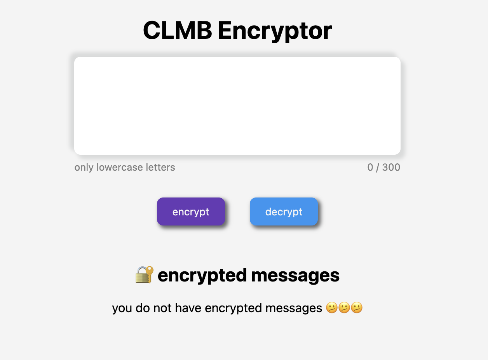
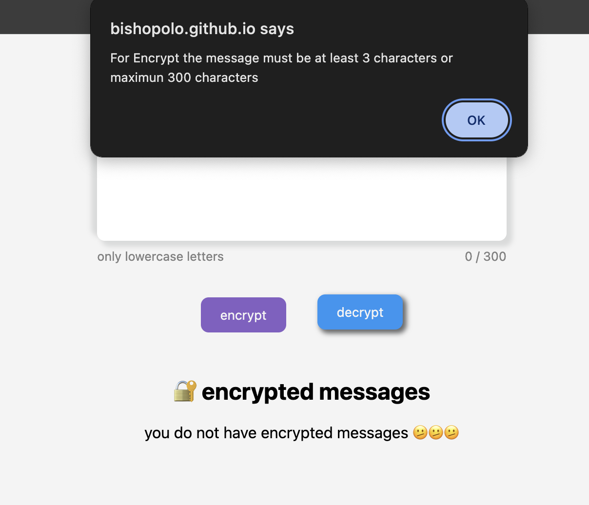
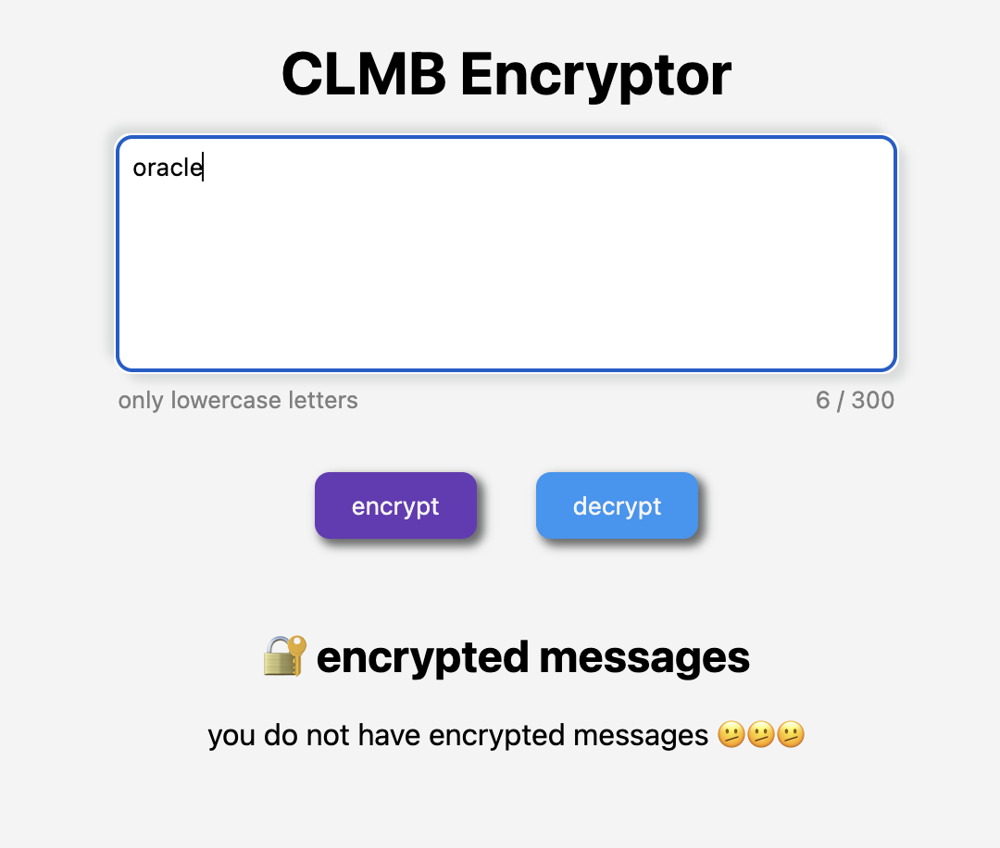
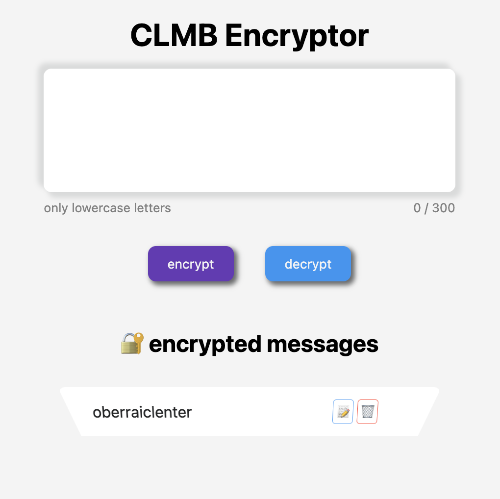
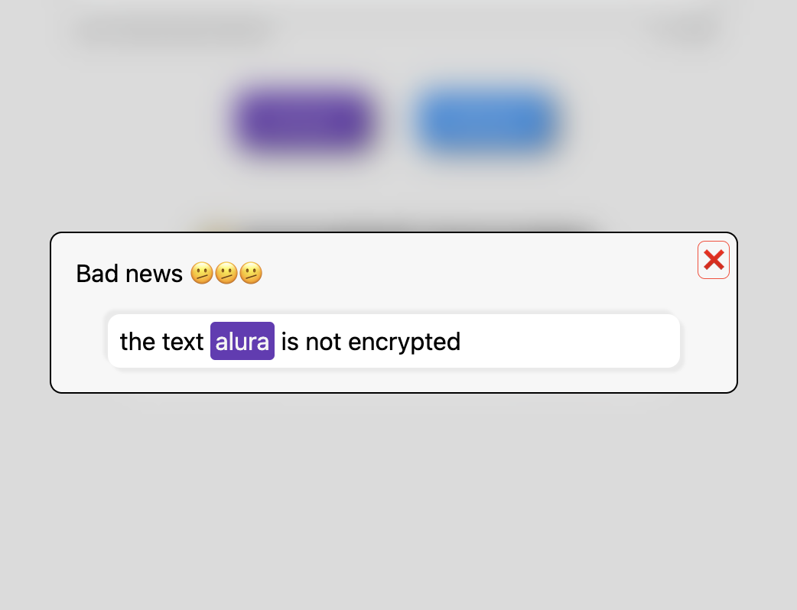
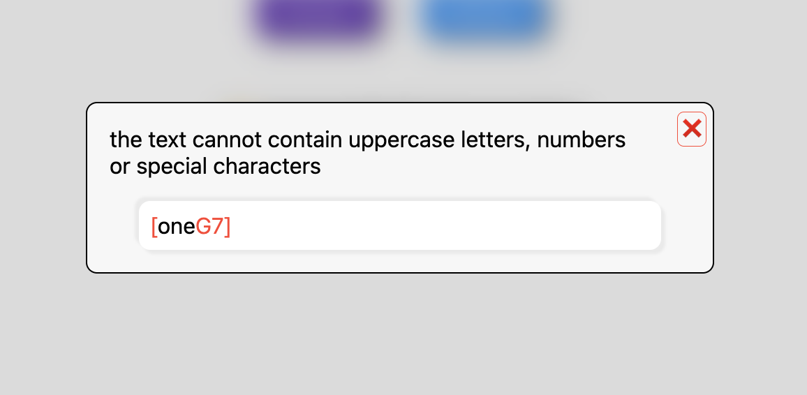

# Challenge encriptador 🔐🔐🔐

En el curso de Prácticando lógica de programación: Challenge Encriptador de texto
Nos fue encargado hacer un encriptador con las siguientes caracteristicas:

- La letra "e" es convertida para "enter"
- La letra "i" es convertida para "imes"
- La letra "a" es convertida para "ai"
- La letra "o" es convertida para "ober"
- La letra "u" es convertida para "ufat"
- Debe funcionar solo con letras minúsculas
- No deben ser utilizadas letras con acentos ni caracteres especiales

Se decide agregar ciertas caracteristicas al challenge

- Como minimo se debe ingresar 3 letras y máximo 300
- Se acepta la letra `ñ`
- si solo se agrega espacios o saltos de línea se muestra una alerta de que agregue texto
- Si el texto ingresado contiene caracteres especiales, números o mayúsculas se muestra un modal indicando que no están permitidas y se ponen de color rojo
- Se puede encriptar varios mensajes, cada mensaje se irá mostrando en la parte inferior del mas reciente al mas antiguo, cada mensaje tiene dos botones, uno para copiar y otro para eliminar el mensaje encriptado
- si al momento de desencriptar el texto no está encriptado se muestra un modal indicando que el texto no está encriptado
- Si el texto está encriptado se muestra un modal con el texto desencriptado

demo [encriptador](https://bishopolo.github.io/alura/fase1/encryptor/index.html)

